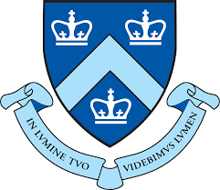
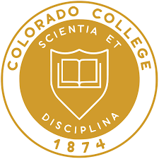

### Hi there 👋 

My name is Nick Bohm and I'm a junior at Columbia studying Computer Science. I have past experience interning at Cisco and Lexidyne as a Software Engineer. I am currently working on a mobile app using react native, Postgres, and solidity. 

| | | | |
|:--:|:--:|:--:|:--:|
| </img> | [Columbia University](https://www.columbia.edu/) | B.S. in Computer Science | 2022-2024 |
| </img> | [Colorado College](https://www.coloradocollege.edu/) |  B.A. in CS (Transfer) | 2019-2022 |

